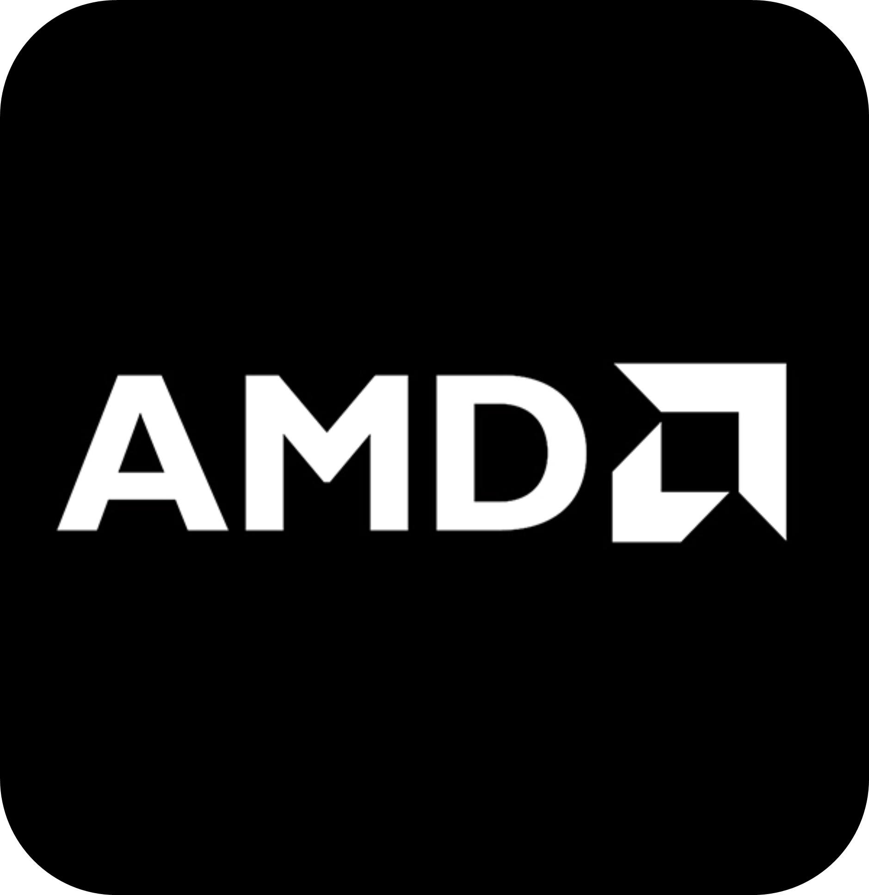
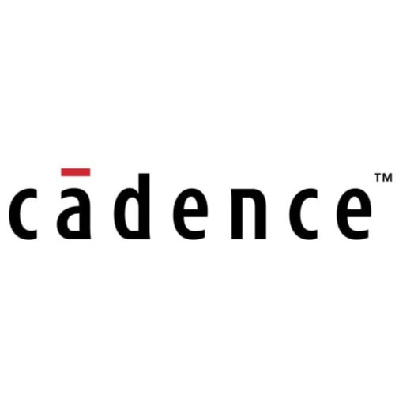
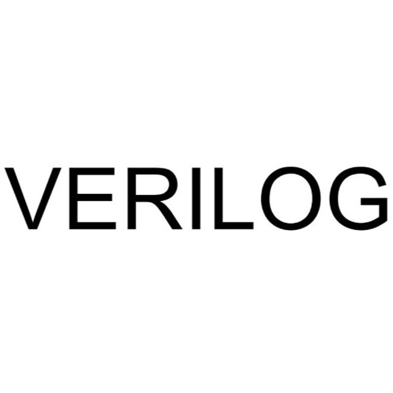
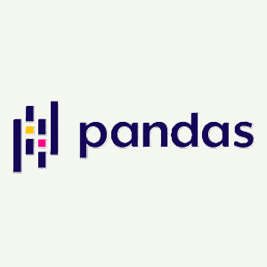
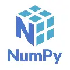
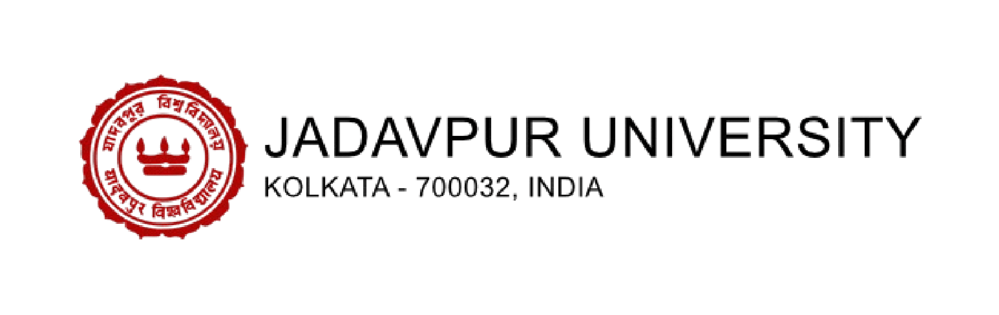

  

# 👋 Hie, I'm **Krishnarjun Mitra**

- ### 🎓 B.E. in Electronics & Telecommunication at Jadavpur University
- ### 🖥️ Software Developer | 🔬 VLSI Designer | 💡 Embedded Systems Researcher | 🎸 Love Art and Musics

  

  

  

  

## 🔧 **Skills Snapshot**

**Hardware & EDA Tools:**  
Vivado, Virtuoso, Synopsys, ModelSim, Arduino, MATLAB

**Programming Languages:**  
C, C++, Python, Verilog, SystemVerilog, JavaScript

**Web & App Development:**  
React, Vite, TailwindCSS, Bootstrap, Express.js, MongoDB

**Tools & Platforms:**  
SQL, Vercel, Postman, Github, VS Code

**AI & Data Tools:**  
Scikit-learn, Pandas, NumPy

  

  <table>
    <!-- Row 1: Core Hardware / EDA -->
    <tr>
      <td align="center">
        
         Vivado
      </td>
      <td align="center">
        
         Virtuoso
      </td>
      <td align="center">
        
         Synopsys
      </td>
      <td align="center">
        
         Arduino
      </td>
      <td align="center">
        
         MATLAB
      </td>
      <td align="center">
        
         Modelsim
      </td>
    </tr>    
    <!-- Row 2: Programming Languages -->
    <tr>
      <td align="center">
        
         C
      </td>
      <td align="center">
        
         C++
      </td>
      <td align="center">
        
         Python
      </td>
      <td align="center">
        
         System Verilog
      </td>
      <td align="center">
        
         Verilog
      </td>
      <td align="center">
        
         JavaScript
      </td>
    </tr>    
    <!-- Row 3: Frameworks & Libraries -->
    <tr>
      <td align="center">
        
         React
      </td>
      <td align="center">
        
         Vite
      </td>
      <td align="center">
        
         Tailwind
      </td>
      <td align="center">
        
         Bootstrap
      </td>
      <td align="center">
        
         Express
      </td>
      <td align="center">
        
         MongoDB
      </td>
    </tr>    
    <!-- Row 4: Tools & Platforms -->
    <tr>
      <td align="center">
        
         SQL
      </td>
      <td align="center">
        
         Pandas
      </td>
      <td align="center">
        
         Numpy
      </td>
      <td align="center">
        
         Vercel
      </td>
      <td align="center">
        
         Postman
      </td>
      <td align="center">
        
         VS Code
      </td>
    </tr>
  </table>

  

  

<table align="center">
  <tr>
    <td align="center" width="50%">
      
    </td>
    <td align="left" width="50%">
      <h3>📂 Verilog-Projects</h3>
      
<strong>Modular RTL Design & Verification Library</strong>

      <ul>
        <li>✅ Synthesizable Verilog HDL</li>
        <li>🧪 Functional Testbenches</li>
        <li>📊 Waveform & Truth Table Outputs</li>
        <li>📚 Markdown Reports & Style Guides</li>
        <li>🏗️ Schematic & Synthesis Results</li>
      </ul>
      

        
      

    </td>
  </tr>
</table>

  

## 🏗️ **Experience Highlights**

> ### 🔹 **Academic Projects & Research (Jadavpur University)**

<code><b>Jadavpur University (Sep 2023 – Present)</b></code>

- **Digital Clock System** → Designed with counters, 7-segment displays, and crystal oscillator  
- **Bluetooth-Controlled Nano Car Bot** → Built using Arduino, motor drivers, and wireless module  
- **Analog Circuit Prototyping** → Hands-on with BJTs, MOSFETs, RC networks, Op-Amps  
- **Verilog RTL Design Projects** → Half/Full adders, sequential circuits, testbenches, waveform analysis  
- **Peripheral Interfaces** → Practiced UART, SPI, I²C, ADC/DAC integration and PCB prototyping  

  

## 🔗 **Links**

- 🔗 Portfolio: [krishnarjun-mitra.vercel.app](https://krishnarjun-mitra.vercel.app)
- 🔗 LinkedIn: [linkedin.com/in/krishnarjun-mitra](https://www.linkedin.com/in/krishnarjun-mitra/)
- 🔗 GitHub: [github.com/Krishnarjunmitra](https://github.com/Krishnarjunmitra)
- 📧 Email: mailtokrishnarjun@gmail.com

  

  

### 💡 **_"I love solving problems with a soldering iron in one hand and a debugger in the other."_**

  

## 🏆 **Github Achievements**

  
  
  

 
<!-- 

   -->

  

I’m always excited to collaborate on projects that blend <b>hardware design, embedded systems, and software innovation</b>.  
From experimenting with <b>analog circuits</b> and <b>Verilog RTL</b> to exploring <b>full-stack development</b>, I thrive on bridging the gap between low-level design and high-level applications.  

Tech, to me, is best when shared—knowledge multiplies when exchanged.  
Whether it’s <b>hands-on circuit prototyping</b>, <b>developing embedded solutions</b>, or <b>building scalable software systems</b>, I enjoy exchanging ideas, mentoring peers, and learning from the community.  

Every project I take up is a chance to <b>solve a real-world problem</b>, refine my skills, and push a little further toward excellence.  
If my profile resonates with your interests, feel free to connect with me—I’d love to learn, collaborate, and grow together. 🚀  

Let’s create solutions that matter, innovate with purpose, and make technology more impactful—one project at a time. 🌍  

  

  <b>Keep Learning</b> 
  <b>Thank You</b>

  © 2025 Krishnarjun Mitra. All rights reserved. 
  Some assets (icons, badges, stats widgets) are sourced from open-source projects and are used under their respective licenses.

  

  
